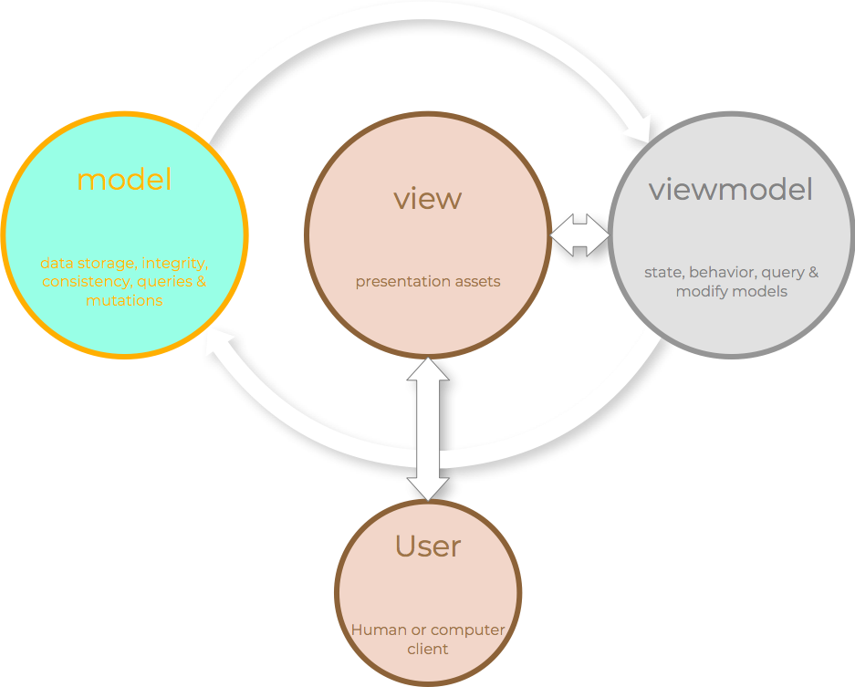
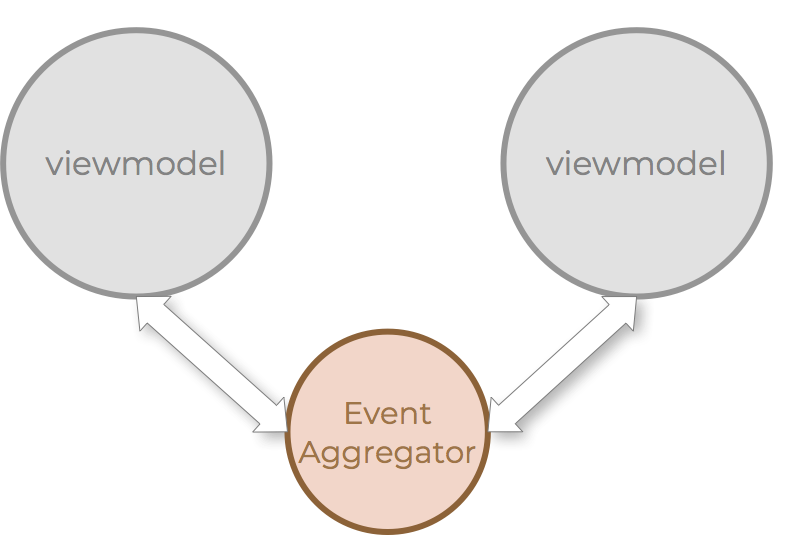

This page talks about the core principles at play, our mindset going into
this project and what is expected from any contributions to the project.

## Target scenario(s)

This library is meant to make it easier to build line of business types of
applications. It is not optimized for other scenarios, although it might
be useful and work fine in other scenarios. With LOB as the target, it
means that there is much more of an application thinking going into this
library. Its all about making applications consistent in look and feel
and make applications more maintainable over time.

## Target persona

The typical developer usin

## Core Mindset

https://en.wikipedia.org/wiki/Single_responsibility_principle

https://en.wikipedia.org/wiki/Separation_of_concerns

## Consistency

## Cohesion

## One and once only (DRY principle)

## UWP controls as reference

## Design Language

## API thinking

## Encapsulation

## Decoupling

## Separation

## Model View View Model (MVVM)

MVVM originates from [Martin Fowler's](https://martinfowler.com)
[Presentation Model](https://martinfowler.com/eaaDev/PresentationModel.html)
from 2004 and is a variation of Trygve Reenskaug's MVC from 1976.
Microsoft iterated on this and [introduced MVVM in 2005](https://blogs.msdn.microsoft.com/johngossman/2005/10/08/introduction-to-modelviewviewmodel-pattern-for-building-wpf-apps/).

### Model

### View

### View Model

### Event Aggregator

## Testing

## Aurelia building blocks
