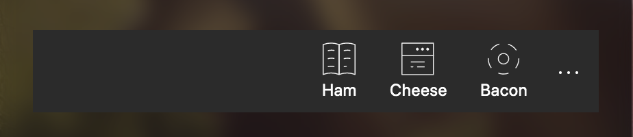

The Command Bar is a toolbar aimed to use for commands that counts for the "area" it is placed.

It can be put on top as an app header, and the commands is visually connected to the application. It can be placed within an Acrylic card or an other type of section, and it's then visually indicationg that the given commanrs for the section you're in.


## Anatomy

The control is build up with theese sections:

- `content-block`
- `primary-commands`
- `secondary-commands`

### Content block

This is typically where you put a header that describes section or area where the command bar lives. It renders as a `<div class="content-block">`.

### Primary commands

Your primary commands goes here. These are the commands that will be visible in the bar. It renders as a `<div class="primary-commands">`. It's recommended to use the [CommandBarButton]() provided along with this control, but you are free to write your own code in this block.

### Secondary commands

To save some space, you have th possibility to hide commands in a hidden list. When clicking the elipsis button out right, a list with secondary commands will appear. It renders as a `<div class="secondary-commands">`. It's recommended to use the [CommandBarButton]() provided along with this control, but you are free to write your own code in this block.

## Code example

```html
<command-bar>
  <primary-commands>
    <command-bar-button></command-bar-button>
  </primary-commands>
  <secondary-commands>
    <command-bar-button></command-bar-button>
  </secondary-commands>
  <content-block>
    <em>Content block</em>
  </content-block>
</command-bar>
```


## Options

| Property               | Type       | Description                                                          | Default value |
| ---------------------- | ---------- | -------------------------------------------------------------------- | ------------- |
| `commandLocation`      | **String** | Sets the visual location of the primary commands                     | 'right'       |
| `commandLabelLocation` | **String** | Sets the visual location of the label for primary commands.          | 'right'       |
| `zIndex`               | **Number** | If set, it'll add a custom z-index value, by CSS, for this instance. | NaN           |

### commandLocation

Setting this will decide where the primary commands will render. There are four accepted values for this, `left`, `center`,`right`and `distributed`. If not set, the primary commands will render to the right.

#### right (or not set)

```html
<command-bar command-location="right"></command-bar>
```


#### left

```html
<command-bar command-location="left"></command-bar>
```


#### center

```html
<command-bar command-location="center"></command-bar>
```


#### distributed

```html
<command-bar command-location="distributed"></command-bar>
```


### commandLabelLocation

When using [CommandBarButton](), this setting decides where the labels of the primary commands will render. There are three accepted values for this: `right`, `bottom` and `hidden`. If not set, the label will render to the right, as the examples above.

#### right (or not set)

```html
<command-bar command-label-location="right"></command-bar>
```


#### bottom

```html
<command-bar command-label-location="bottom"></command-bar>
```



#### hidden

```html
<command-bar command-label-location="hidden"></command-bar>
```


#### Other combinations

```html
<command-bar command-location="left" 
             command-label-location="bottom">
</command-bar>
```


```html
<command-bar command-location="left" 
             command-label-location="hidden">
</command-bar>
```


```html
<command-bar command-location="center" 
            command-label-location="bottom">
</command-bar>
```


```html
<command-bar command-location="center" 
             command-label-location="hidden">
</command-bar>
```


```html
<command-bar command-location="distributed" 
             command-label-location="bottom">
</command-bar>
```


```html
<command-bar command-location="distributed" 
             command-label-location="hidden">
</command-bar>
```


### zIndex

When dealing with elements on a website or a webapp, you might end up with issues with stuff overlapping each other in a way you don't want. This property lets you decide the css z-index on the given instance of a command-bar.

```html
<command-bar z-index="101"></command-bar>
```

will render this specific command-bar with a style tag just for this instance.
