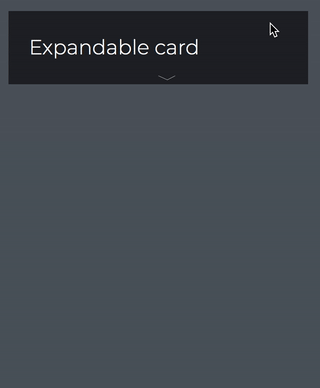

Expandable card is a component you can use if you want an acrylic card to present a small ammount of content initially, but can be clicked and then present much more information.
every pixel of the control is clickable.



## Anatomy

The control consists of the following sections: **banner** and **content**.

### Banner

The banner is intended to be used for the content that is always visible. It renders as a `<div>` with the class `expandable-card-banner` within a `<header>`, so you are free to use whatever HTML tags you desire inside the `<banner>` tag.

### Content

The content part where you put your hidden content. When you click the card, this content will be animated to be visible. It renders as a `<div>` with the class `expandable-card-content`, so you are free to use whatever HTML tags you desire inside the `<content>` tag.

## Code Example

```html
<expandable-card>
  <banner>
    <h3>
      Expandable card
    </h3>
  </banner>
  <content>
    <p>
      More information
    </p>
    <p>
      Cras justo odio, dapibus ac facilisis in, egestas eget quam. Donec sed odio dui. Aenean lacinia bibendum nulla sed consectetur. Maecenas faucibus mollis
      interdum.
    </p>
  </content>
</expandable-card>
```

## Options

| Property     | Type        | Description                             | Default value |
| ------------ | ----------- | --------------------------------------- | ------------- |
| `isExpanded` | **Boolean** | Decides if the card is expanded or not. | false         |

### isExpanded

When clicking the card, this option will toggle `true` / `false`.

It's also possible to set value to this option through an attribute in the app that consumes this component.

```html
<expandable-card is-expanded="true"></expandable-card>
```
