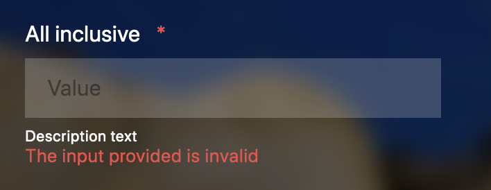
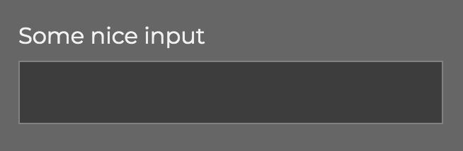
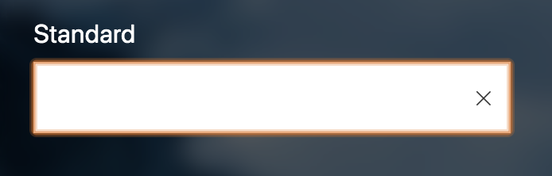
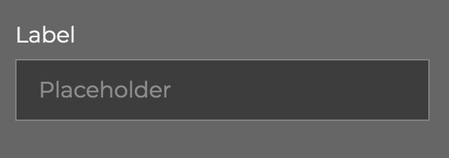
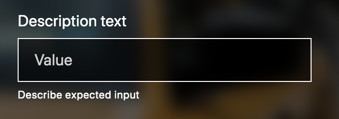
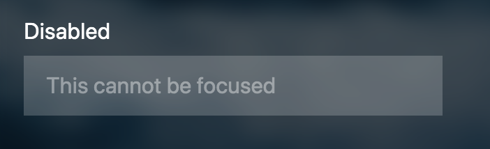
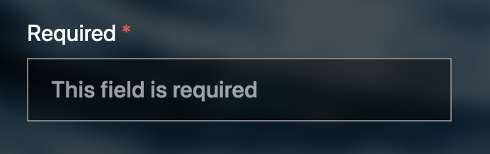
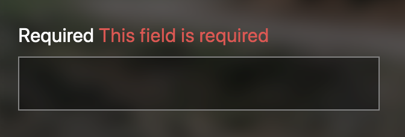
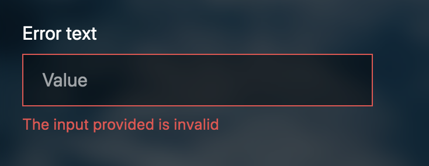

TextField is a component that renders an intput field with the type of text. You can provide different options as described below. The field will be given an unique id.

Example of how the component is rendered when all options are provided.



```html
<text-field label="All inclusive" value="Value" placeholder="Placeholder text" description="Description text" is-disabled="true" is-required="Required" reuired-text="Field is required" error-message="The input provided is invalid"></text-field>
```

```html
<div class="text-field invalid">
    <label for="input-b87940db">All inclusive <span class="required">*</span></label>
    <div class="input-footprint">
      <input type="text" name="input-b87940db" id="input-b87940db" placeholder="Placeholder text" disabled="" required="">
      <i class="delete-cross" click.delegate="clearValue()">
        <svg width="10" height="10" viewBox="0 0 10 10" fill="none" xmlns="http://www.w3.org/2000/svg">
          <path d="M9.57617 0.951172L5.5332 5L9.57617 9.04883L9.04883 9.57617L5 5.5332L0.951172 9.57617L0.423828 9.04883L4.4668 5L0.423828 0.951172L0.951172 0.423828L5 4.4668L9.04883 0.423828L9.57617 0.951172Z" fill="black" fill-opacity="0.8"></path>
        </svg>
      </i>
    </div>
    <small class="description-text">Description text</small>
    <small class="error-text">The input provided is invalid</small>
  </div>
```

You can override styling with your own styling in your app, or you can set your own values to a set of SCSS variables. [More information on styling with SCSS vaiables.](styling)

## Options

| Property        | Type        | Description                                                         | Default value |
| --------------- | ----------- | ------------------------------------------------------------------- | ------------- |
| `label`         | **String**  | The label indicator for the text field.                             |               |
| `value`         | **String**  | The default value when initiating the text field.                   |               |
| `placeholder`   | **String**  | The text that goes in the placeholder attribute for the text field. |               |
| `description`   | **String**  | The text that goes in the placeholder attribute for the text field. |               |
| `isDisabled`    | **Boolean** | Decides if the field should be disabled or not                      | false         |
| `isRequired`    | **Boolean** | Decides if the field should be required or not                      | false         |
| `required-text` | **string**  | Text that indicates that the field is required                      | \*            |
| `errorMessage`  | **String**  | The error message that shows if validation fails                    | false         |

### label

Above all text fields there should be alabel that describes the purpose/content for what input goes in the text field.

Is to be set in an `label`attribute from the consumer application.

```html
<text-field label="Standard"></text-field>
```



Or if bound to an object:

```html
<text-field label.bind="command.propertyInputName"></text-field>
```

### value

The `value` is the input value of the text field. This will typically be bound to a command input.

```html
<text-field label="Standard" value.bind="command.propertyInputValue"></text-field>
```



### placeholder

The placeholder is text that is displayed in the text field as if it was value, but a bit faded color compared to the input value. It dissapears when the field gets focus and reappear when it loses focus if there is no value.

```html
<text-field label="Placeholder" placeholder="This is a placeholder"></text-field>
```



### description

Can be set to give a short description of expectation to the input or other small hints.

```html
<text-field label="Description text" description="Describe expected input"></text-field>
```



### isDisabled

Sets the input field to be disabled.

```html
<text-field is-disabled="true" label="Disabled" placeholder="This cannot be focused"></text-field>
```



### isRequired

Sets the input field as required. It will be indicated with a red asterix at the label and bolder text in placeholder.

```html
<text-field is-required="true" label="Required" placeholder="This field is required"></text-field>
```



### requiredText

Is set default to `*`. Can be overridden to desired text.

```html
<text-field label="Required" required-text="This field is required" is-required="true"></text-field>
```



### errorMessage

Error message is typically populated from the commandResult from the app using this component.

When `errorMessage` is populated, the field will appear invaøid by setting the border color to red and show the red error message below the input field.


