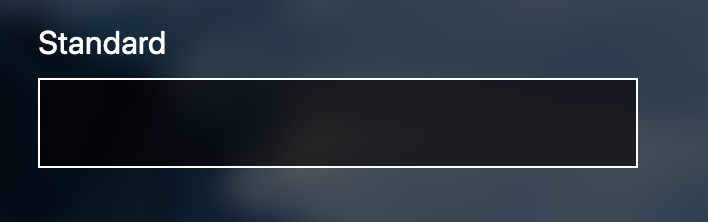
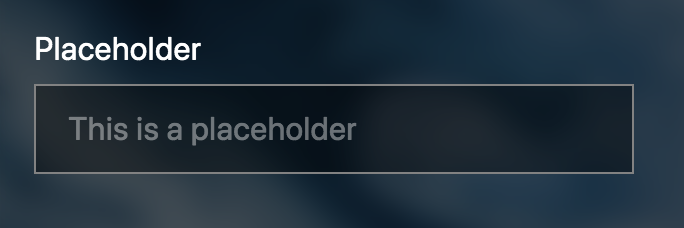

Description

## Options

| Property       | Type        | Description                                                         | Default value |
| -------------- | ----------- | ------------------------------------------------------------------- | ------------- |
| `label`        | **String**  | The label indicator for the text field.                             | ''            |
| `value`        | **String**  | The default value when initiating the text field.                   | ''            |
| `placeholder`  | **String**  | The text that goes in the placeholder attribute for the text field. | ''            |
| `isDisabled`   | **Boolean** | Decides if the field should be disabled or not                      | false         |
| `isRequired`   | **Boolean** | Decides if the field should be required or not                      | false         |
| `errorMessage` | **String**  | The error message that shows if validation fails                    | false         |

### label

Above all text fields there should be alabel that describes the purpose/content for what input goes in the text field.

Is to be set in an `label`attribute from the consumer application.

```html
<TextField label="Some nice input"></TextField>
```



Or if bound to an object:

```html
<TextField label.bind="command.propertyInputName"></TextField>
```

### value

The `value` is the input value of the text field. This will typically be bound to a command input.

```html
<TextField label=Label input.bind="command.propertyInputValue">
```  


### placeholder

The placeholder is text that is displayed in the text field as if it was value, but a bit faded color compared to the input value. It
  dissapears when the field gets focus and reappear when it loses focus if there is no value. 

```html
<TextField label="Label" placeholder="Placeholder"></TextField>
```



### isDisabled

```html
<TextField is-disabled="true" placeholder="Disabled"></TextField>
```


### isRequired

{}
Not implemented yet.

Needs styling from Styles
{}

### errorMessage

{}
Not implemented yet.

Needs styling from Styles
{}
